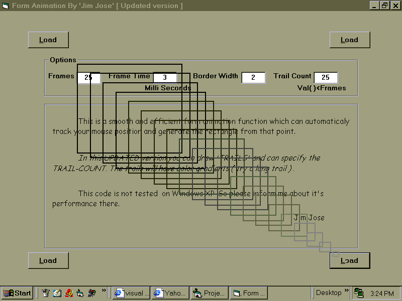



## \[ Yes\! The Transparent Rectangle Form Animation \] \- V2

### Description

This was my dream function which can animate your form with transparent rectangles during Loading and Unloading. This updated version can create trails for the form and with nicely gradiented colors. This function is powerful and works pefect. Enjoy! and please leave your comments.
 
### More Info
 

             |
---                |---
**Submitted On**   |2004-01-08 13:46:56
**By**             |[JJJJJJJJ](https://github.com/Planet-Source-Code/PSCIndex/blob/master/ByAuthor/jjjjjjjj.md)
**Level**          |Beginner
**User Rating**    |4.9 (44 globes from 9 users)
**Compatibility**  |VB 6\.0
**Category**       |[Graphics](https://github.com/Planet-Source-Code/PSCIndex/blob/master/ByCategory/graphics__1-46.md)
**World**          |[Visual Basic](https://github.com/Planet-Source-Code/PSCIndex/blob/master/ByWorld/visual-basic.md)
**Archive File**   |[\[\_Yes\!\_The1857722262005\.zip](https://github.com/Planet-Source-Code/jjjjjjjj-yes-the-transparent-rectangle-form-animation-v2__1-59155/archive/master.zip)

